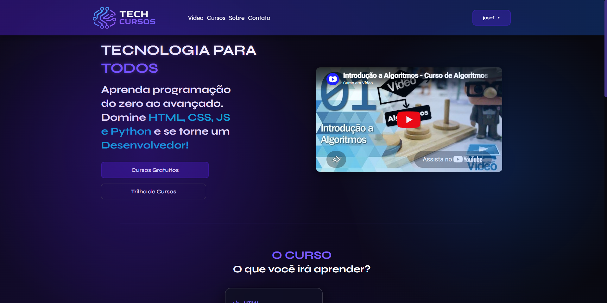

# 📚 Projeto Faculdade

Projeto desenvolvido durante o primeiro semestre de Análise e Desenvolvimento de Sistemas na UNISUAM.

O objetivo deste projeto foi praticar conceitos de desenvolvimento web utilizando HTML, CSS e JavaScript, aplicando estruturação de páginas, estilização e interatividade.

---

## 🚀 Tecnologias utilizadas

- HTML5
- CSS3
- JavaScript
- Git e GitHub

---

## 💻 Funcionalidades

- Interface responsiva
- Estruturação semântica em HTML
- Estilização com CSS
- Interações utilizando JavaScript
- Formulários e validações
- Organização de layout

---

## 📸 Preview do projeto




---

## 📂 Como executar o projeto

```bash
# Clone o repositório
git clone https://github.com/herbertfariasss/Projeto-Faculdade.git
